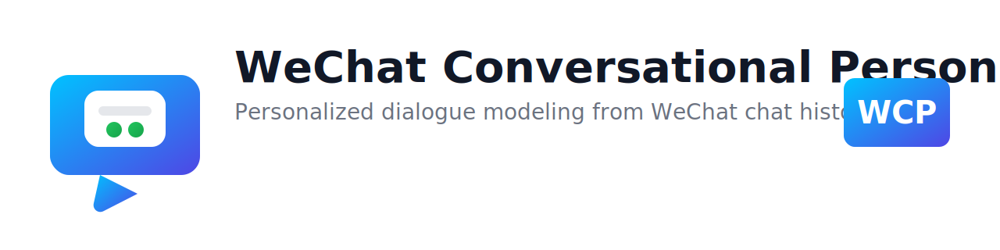
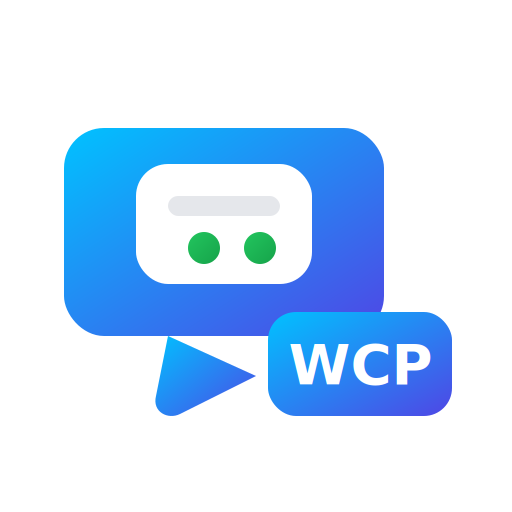
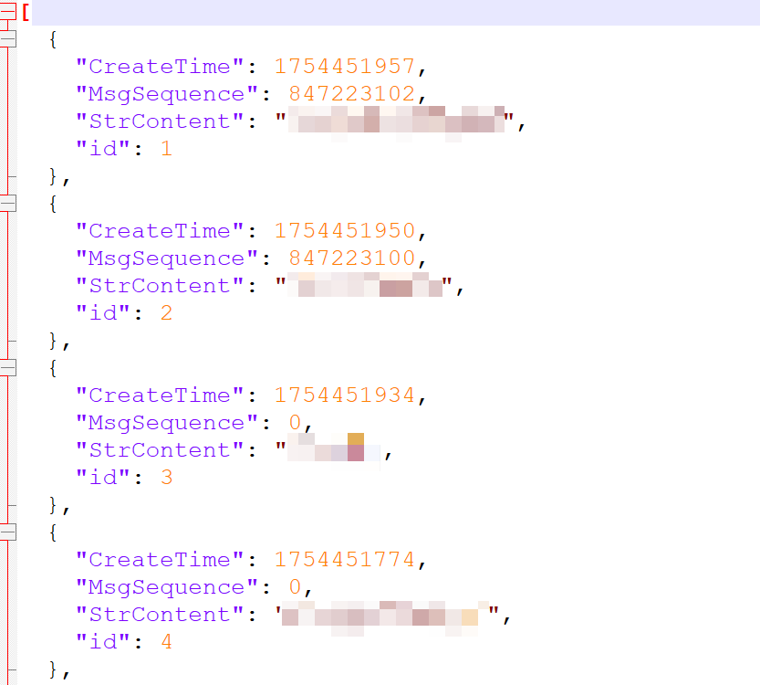
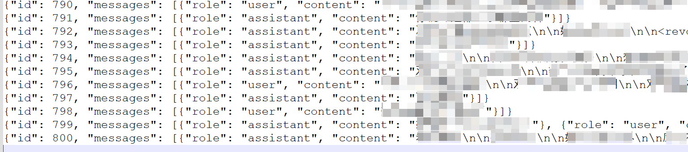
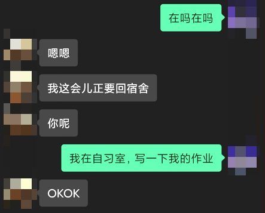

  <!-- 浅色模式下显示 -->
  <picture>
    <source media="(prefers-color-scheme: dark)" srcset="./img/wcp-logo-dark.svg" />
    
  </picture>

<h1 align="center">🤖💬 WeChat Conversational Persona (WCP)</h1>

  

---

## 📖 项目简介
**WeChat Conversational Persona (WCP)** 是一个基于微信聊天记录的个性化对话建模项目。  
本项目通过收集与特定用户的聊天数据，对预训练大语言模型（LLM）进行微调，使模型能够学习该用户的语言风格、表达习惯和常用语气，从而在对话中实现 **模仿、延续和复现** 该用户的交流方式。

模型食用地址：https://www.modelscope.cn/models/hellodarling/WeChat-DialogLM
## 🎯 项目目标
- **个性化复刻**：捕捉并模仿特定用户的说话风格。  
- **持续对话**：实现与“AI分身”的自然对话体验。  
- **可扩展性**：支持对不同用户的数据进行微调，生成个性化模型。  
- **应用探索**：为个性化聊天机器人、虚拟陪伴和社交模拟提供技术基础。  

## ⚙️ 技术路线
1. **数据处理**  
   - 提取并清洗微信聊天记录  
   - 构建对话格式数据集  

2. **模型训练**  
   - 基于大语言模型（如 Qwen, LLaMA 等）  
   - 采用 LoRA / PEFT 技术进行高效微调  

3. **模型应用**  
   - 模拟对话：实现自然流畅的个性化交流  
   - 风格复现：尽可能还原目标用户的语气与习惯  

## 📌 适用场景
- 个性化聊天助手  
- AI 语气复刻与风格模仿  
- 社交交互与虚拟陪伴  
- 对话风格研究  

## 📜 免责声明
本项目仅用于 **科研与技术探索**，请确保数据使用符合相关法律法规，且仅在获得授权的情况下使用个人聊天记录。  
严禁将本项目用于侵犯隐私或其他不当用途。

## 🛠️ 实现环境

### 1. 硬件环境
- GPU: NVIDIA RTX 3060 6GB（支持 CUDA）  
- CPU: Intel i7-12700
- 内存: 16GB  
- 硬盘: 20GB 可用空间（存放聊天数据和模型权重）  

### 2. 软件环境
- 操作系统: Windows 11
- PC微信版本：3.9.10.27
- Python: 3.11.4
- PyTorch: 2.2+（GPU 版本）  
- Transformers: 4.51.0  
- PEFT: 0.14.0（用于 LoRA 微调）  
- swanlab: 0.6.8 （用于可视化微调过程）
- wxauto: 39.1.15 （用于监听和回复微信消息）

---

## 🚀 实现步骤

以下给出一个 **实现的具体流程**，展示如何从微信聊天记录数据集微调模型，并生成对话。  

---

### 1️⃣ 数据准备

要获取与某人的聊天记录，首先必须从本地数据库中提取数据。微信使用的是 **SQLite** 数据库，且 `.db` 文件经过 AES 加密处理，因此必须先获取解密密钥 **key**，解密后即可访问聊天记录。

#### 1.1 🔑 获取 key
- 参考教程: [52pojie 论坛](https://www.52pojie.cn/thread-1849061-1-1.html)  
- 脚本工具: `search_wecaht_key.exe`

#### 1.2 🔓 解密 db 文件
- 文件示例: `MSG0.db`, `MSG1.db`, …  
- 脚本工具: `decrypt.py`  
- 依赖环境: `pycryptodome==3.21.0`
- 微信聊天数据库文件路径:  C:\Users\Lenovo\Documents\WeChat Files\wxid_xxxxxxxx\Msg\Multi

#### 1.3 💬 提取聊天记录
由于聊天记录分散在不同的 MSG.db 文件中，需要遍历所有文件，搜索指定的 `StrTalker` 字段（用于区分联系人），并按 `CreateTime` 排序，即可获取完整聊天记录。

- 脚本工具: `chat_content.py`  
- 处理示例:

> ⚠️ 注释: `MsgSequence=0` 表示消息为自己发送，非 0 表示对方发送的消息。

---

#### 1.4 🛠️ 处理聊天记录
获取聊天记录后，需要将其处理成模型微调的数据集格式。

1. **按时间切片处理**  
 - 脚本: `to_train.py`  
 - 功能: 将每 200 秒内的聊天记录整理为一条训练数据。

2. **合并连续消息**  
 - 脚本: `to_train_merge.py`  
 - 功能: 发送方或接收方连续发送的消息需要合并，否则模型只会输出单条消息，无法模拟自然聊天。

处理示例:

---

### 2️⃣ 模型微调

- **基模型**: `Qwen2.5-1.5B-Instruct`  
- **训练脚本**: `train.py`  

更多细节可参考 👉 [SwanLab 实验详情](https://swanlab.cn/@hhhhhh/wechat-chat-lora?utm_source=website_qr&utm_medium=qr_scan)

---

### 3️⃣ 集成到微信

- **脚本**: `chat_robot.py` （运行前需确保已登录微信客户端）  
- **依赖工具**: [wxauto](https://github.com/cluic/wxauto)  
- **功能**: 将微调后的模型接入微信，实现自动回复。  

#### 💬 聊天示例

---

